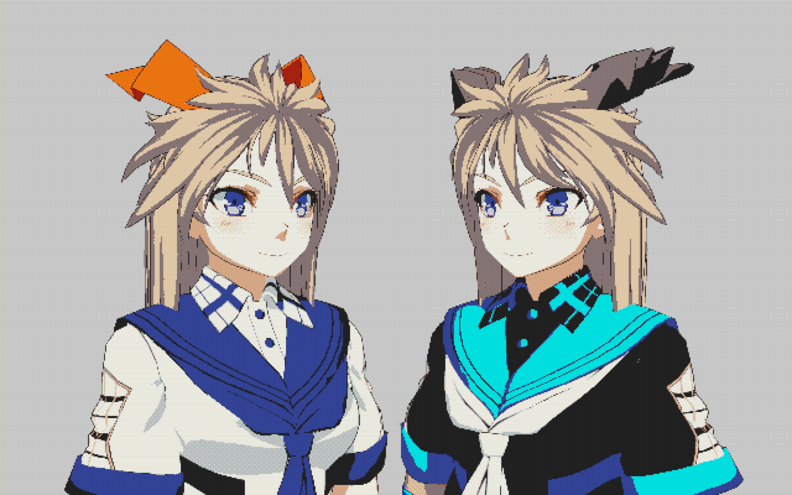
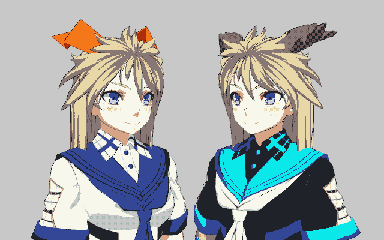
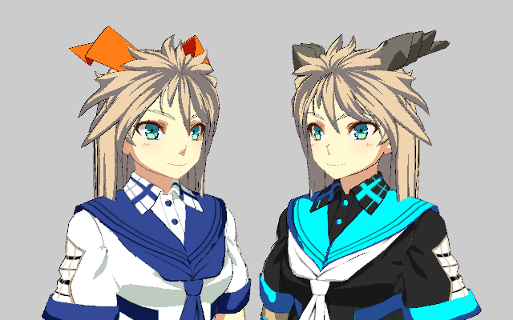
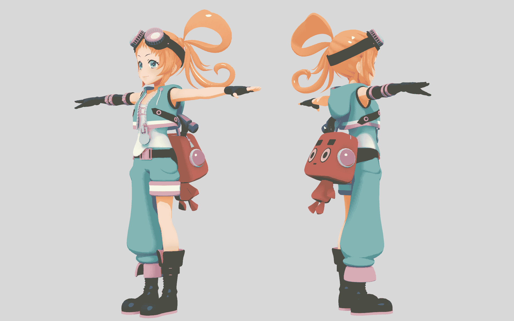
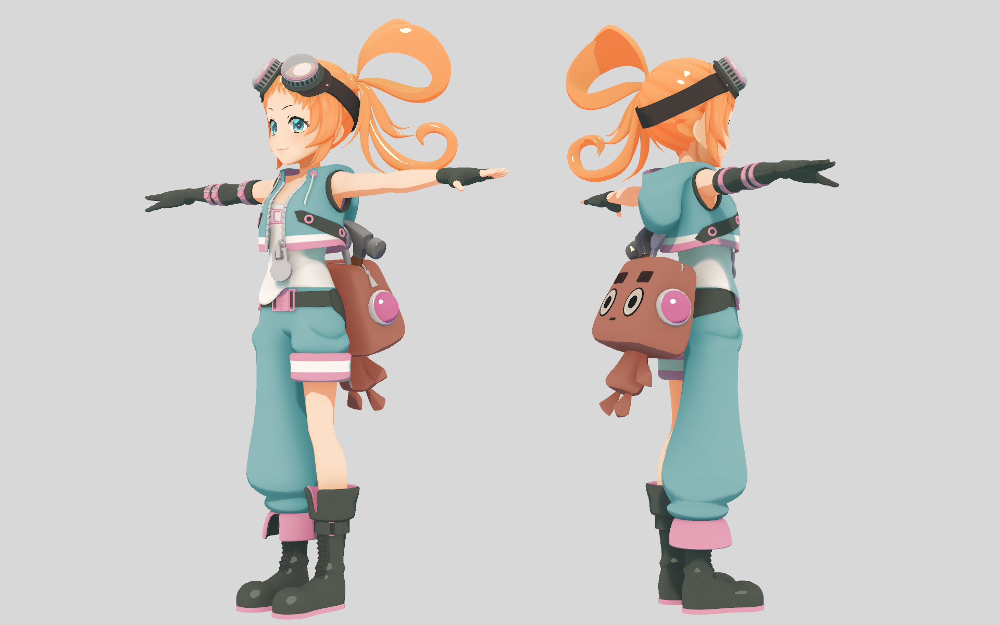
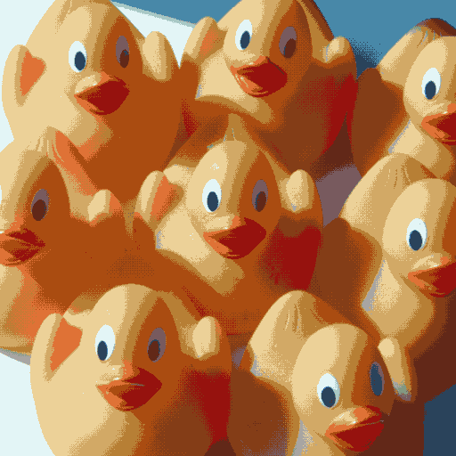
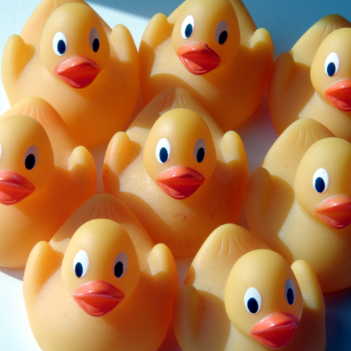
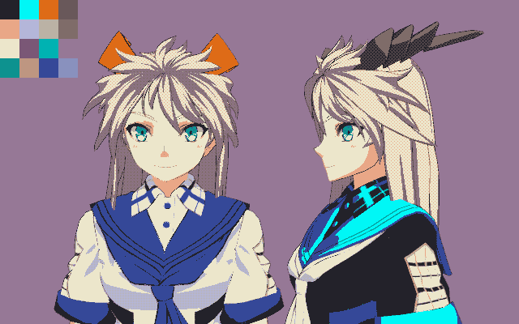
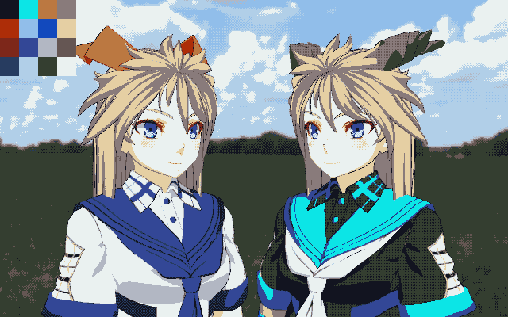

# Pixelism
Pixelism is 4-bit indexed color real-time image processing project.

The motivation for this project is by real-time image processing to reach the visual of master artisanship by the artists of the games released on [NEC PC-9800 series](https://en.wikipedia.org/wiki/PC-9800_series).

- Generate 4-bit indexed color (16 colors) within 16ms using GPU
- Dither with color palette
- Without pre-processing

Figure 1. PC-9801 style image: 4-bit indexed color from 12-bit color and CRT emulation post processing

## Usage
- Install Unity 2022.1.23f1
- Open this project on Unity
- Create new scene or open existing scene
- Add `DisplayController` component to Main Camera
- Key assignment:
  - F1: Show/Hide side menu
  - F4: Capture screenshot
- Offline tool at `Pixelism` -> `Color Quantization` in Editor menu

## Implementation
I implemented [Modified Median Cut](http://www.leptonica.org/color-quantization.html).  
CPU version is baseline and reference for GPU version. This utilizes Unity Jobs with Burst so it is optimized for CPU parallel computing.  
GPU version is fully using compute shader. This is the initial goal.

## Results

All quantized images were applied 4-bit indexed color (16 colors).

|Modified Median Cut (GPU)|Source|
|-|-|
|||

Figure 2. Comparison of [Unity-Chan](https://unity-chan.com/) images (640 x 400)

|Modified Median Cut (GPU)|Source|
|-|-|
|||

Figure 3. Comparison of [PicoChan](https://assetstore.unity.com/packages/3d/characters/humanoids/picochan-220038) images (1920 x 1200)

|Modified Median Cut (GPU)|Source|
|-|-|
|||

Figure 4. Comparison of photo images (512 x 512)

### Performance
CPU: Intel Core i9-9900K 3.60GHz (16 cores)  
GPU: NVIDIA GeForce RTX 2080 Ti

| |Modified Median Cut (**GPU**)| Modified Median Cut (CPU)|
|:-:|-:|-:|
| 640 x 400| 0.9 ms| 3 ms|
|1280 x 800| 1.5 ms| 10 ms|
|1920 x 1200| 2.3 ms| 21 ms|

Table 1. The palette generation time of Demo scene by rendering resolution (Width x Height)

## Discussion

When a scene is moved, the color palette generated may change significantly from that of the previous frame. As a result, the color tones of dithered image may change significantly between frames.
By the same token Unity's Post Processing cause unstable color palette. because of it jitter the camera regardless of anti-aliasing settings.

Since the current focus is on color palette generation, the dithering and color selection algorithm is simple. The color selection may not be as good as the pixel art drawn by the artists.

The background may be too dominant and color palette may not be generated in focused foreground objects. A possible countermeasure to this is to mask focused objects with a depth or stencil on color palette generation.

Many dispatches are causing some overhead. This could be minimized if [ID3D12GraphicsCommandList::ExecuteIndirect](https://learn.microsoft.com/windows/win32/api/d3d12/nf-d3d12-id3d12graphicscommandlist-executeindirect) could be used, but cannot be used in Unity.

Figure 5. Lack of robustness for temporal (color palette is shown in top-left)

Figure 6. Black shirt changed dark green is caused by background (color palette is shown in top-left)

## Future Work
- Temporal robustness
- Spatial robustness
- Masking area for palette generation and dithering
- More better palette generation algorithm
- More better dithering and palette selection algorithm

# License
- Those assets in `Assets/UTJ` are provided Unity-Chan License Terms ([en](https://unity-chan.com/contents/license_en/)/[ja](https://unity-chan.com/contents/license_ja/))
- Those assets in `Assets/Tests/Textures/TESTIMAGES` are provided Creative Commons Attribution-NonCommercial-ShareAlike 4.0 International ([CC BY-NC-SA 4.0](https://creativecommons.org/licenses/by-nc-sa/4.0/))

